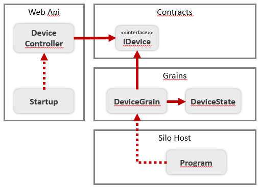

# Orleans Demo

Este é um exemplo de uso do framework Orleans da Microsoft para a construção de aplicações escaláveis e resilientes.
A ideia aqui é simular um sistema que gerencia dispositivos que medem a temperatura (IoT). Cada um dos dispositivos envia para uma API a sua temperatura atual, que é armazenada nos atores (grains) hospedados na camada intermediária (stateful).

Este exemplo considera a persistência dos atores e a gestão do cluster com o uso de um banco de dados SQL Server. A URL de conexão deve ser configurada como um secret da aplicação (chaves *ClusterStorage* e *GrainStorage*)

O exemplo foi desenvolvido em uma máquina Ubuntu, com .NET Core 2.2 e rodando um SQL Server 2019 como um container (Docker).